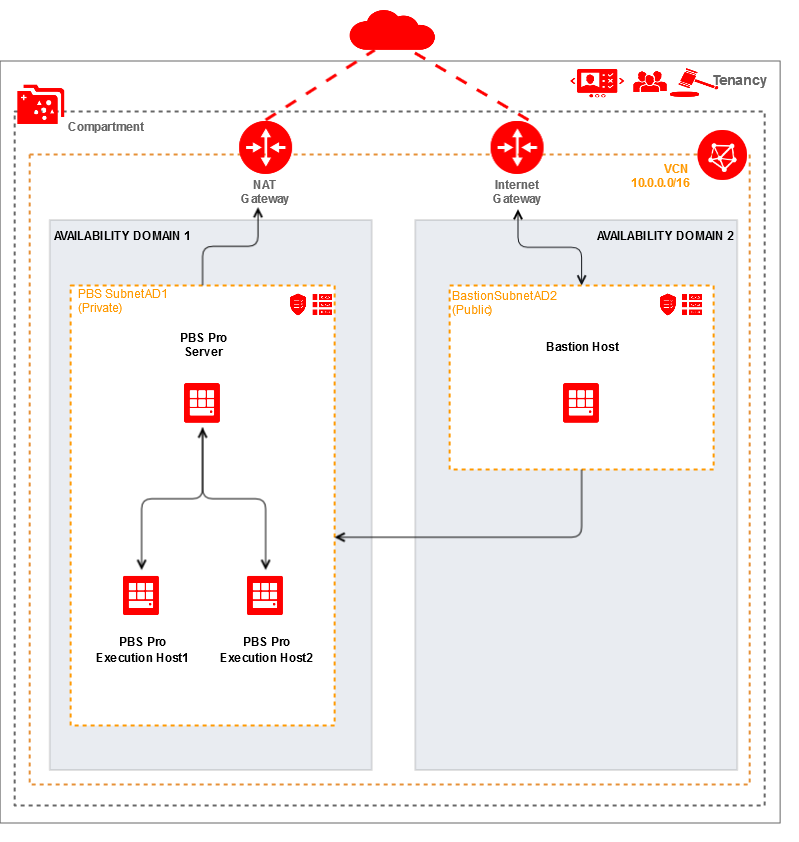

## Create VCN and Deploy PBS Pro Cluster
This example shows how to deploy the PBS cluster (open source version) on the Oracle Cloud Infrastructure using Terraform.. This configuration generally implements this:



It creates a VCN with two route tables, Internet Gateway, NAT Gateway, Security Lists, a bastion subnet, and a private subnet for the PBS Pro cluster.


### Using this example
* Copy terraform.tfvars.template to terraform.tfvars and update terraform.tfvars with the required information
  - To generate SSH key pair: 
```hcl
  ssh-keygen -b 2048 -t rsa
```

* Update variables.tf with your instance options


### Files in the configuration
#### `main.tf`
Defines the compute resources

#### `network.tf`
Defines the networking used in the configuration

#### `outputs.tf`
Defines the outputs of the configuration

#### `terraform.tfvars.template`
Defines the environmental variables used in the configuration

#### `variables.tf`
Defines the variables used in the configuration

### Run Terraform
Initialize Terraform:
```
$ terraform init
```
View what Terraform plans do before actually doing it:
```
$ terraform plan
```
Use Terraform to Provision resources and PBS Pro cluster:
```
$ terraform apply
```

### To connect and test the PBS cluster
Connect to the server using the sample SSH command from the outputs:
```
$ ssh -i ${ssh_private_key} -Ao ProxyCommand="ssh -i ${bastion_private_key} -W %h:%p opc@${bastion_public_ip}" opc@${server_private_ip}
```
Check the status of the server:
```
sudo systemctl status pbs
$ qstat -Bf
```
Check the execution nodes in the cluster:
```
$ pbsnodes -a
```
Run a simple python script:
```
$ touch myjob.py
$ vim myjob.py
$ cat myjob.py
#!/usr/bin/python
#PBS -l select=1:ncpus=1:mem=1gb
#PBS -N HelloJob
print "Hello"
$ qsub myjob.py
0.pbspro-server
```
Check the result of the job:
```
$ ls
HelloJob.e0  HelloJob.o0 myjob.py
```